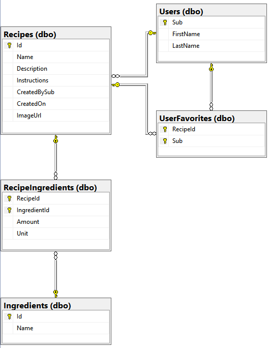

# CulinaryShares Web API

#### This solution consists of two projects, a class library for data access and a web API. My data access library utilizes Entity Framework Core. The API is then consumed by my [CulinaryShares blazor](https://github.com/barlowtyler96/RecipesB2CBlazor) app, as well as the [angular clone](https://github.com/barlowtyler96/AngularRecipesB2C).

#### This project was created to practice data access, SQL Server, Dapper, authentication/authorization, and API developement.

#### I used Microsoft's documentation & code examples, and stack overflow to complete the project. The biggest challenge I faced was learning how to implement Azure's auth flows.

## Techs used: 
* .NET Core
* Entity Framework Core
* SQL Server 2022
* Azure AD B2C
* Azure Blob Storage for images

## Tools Used:
* SSMS
* Postman
* Swagger
* [jwt.io ](https://jwt.io/)

## Features: 
* Secured with Azure AD B2C
* Versioning
* Basic logging with ILogger
* Server-side paging
## Postman Documentation: 
https://documenter.getpostman.com/view/27883820/2s9YCARW1m
  
## Database Schema


## Want to contribute?
1. Open Git Bash to the location you wish to clone the repository.
2. Run the following command:
   ```git clone https://github.com/barlowtyler96/RecipesApiApp.git```
4. Create a new branch:
   ```git checkout -b your-branch-name```
6. Make changes and stage them:
   ```git add .```
7. Commit your changes:
   ```git commit -m "Brief description of the changes"```
8. Push your changes
   ```git push origin your-branch-name```
9. Submit a pull request


